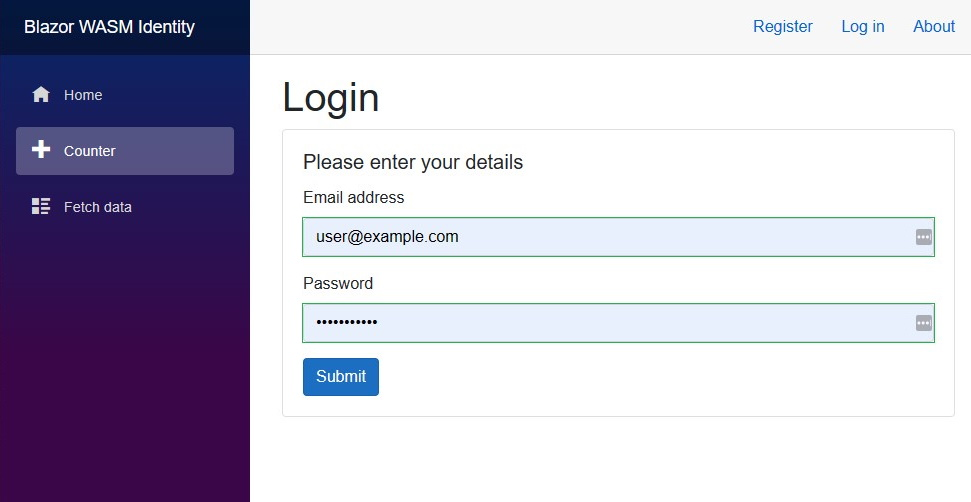

**Kestrel Hosted Blazor WASM + Microsoft Identity / JWT Template with Roles & Policies.**

Code copied from [Chris Sainty's blog](https://chrissainty.com/securing-your-blazor-apps-authentication-with-clientside-blazor-using-webapi-aspnet-core-identity/): "**Securing Your Blazor Apps (Part 2/3/4)**"

**Changes:**
 * Updated to use ASP.NET Core 6 Preview 4
 * Furthermore this template uses a SQLite Database (which is included in the repo) instead of SQLServer

Be sure to check out Chris Sainty's book "Blazor in Action". This book is an example-driven guide to building client-side web apps using C# and .NET - and now [available to buy](https://www.manning.com/books/blazor-in-action?utm_source=sainty&utm_medium=affiliate&utm_campaign=book_sainty_blazor_10_7_20&a_aid=sainty&a_bid=a0dc2c45) via the Manning Early Access Program (MEAP).

This template uses Microsoft Identity so you'll get all of the Microsoft Identity Database Tables with normalized fields, security stamps & password hashing etc. etc.

With this you don't need IdentityServer4/5..(11😉) for Hosted Blazor WASM anymore, plus authorization & authentication is done in the Blazor Client App itself (with a REST API/JSON to the server)), it doesn't redirect you to the IdentityServer (Areas/Identity) Register/Login Razor Pages on the server. (_What was that?!_)

**User/Login Information:**

Counter Menu (User Policy)
 * user name: user@example.com
 * password: Qwerty1234#

Fetch Data Menu (Admin Policy)
 * user name: admin@example.com 
 * password: Qwerty1234#
  
**NOTE:** Although it runs out of the box, I've done this upgrade in a day and it's possible I've made some errors. This is just a template to get you started, don't use it in production (see for example: [Server/Controllers/AccountsController.cs](https://github.com/JeepNL/Hosted_Blazor_WASM_Identity/blob/master/Hosted_Blazor_WASM_Identity/Server/Controllers/AccountsController.cs))

Also this sample template needs to be updated so it automatically refreshes its JWT tokens (Now it uses tokens valid for a day when you login).
